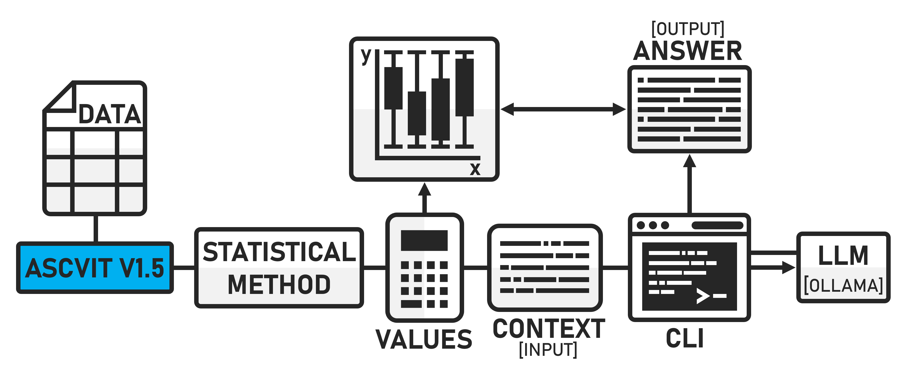
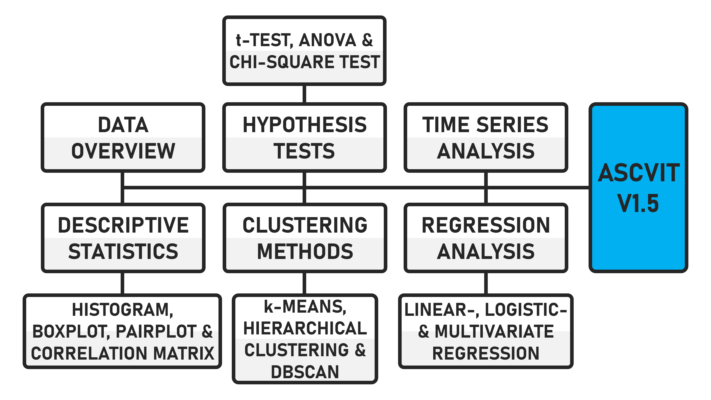

# ASCVIT V1.5 APP
## Automatic Statistical Calculation, Visualization, and Interpretation Tool

This repository, developed by Stefan Pietrusky, is based on the article published at [Towards Data Science](https://medium.com/towards-data-science/ascvit-v1-automatic-statistical-calculation-visualization-and-interpretation-tool-aa910001a3a7). In this article, I discuss the development of a first version (V1) of a local app that can be used to automatically apply various statistical methods to any datasets. The enhanced version of ASCVIT (V1.5) now includes automatic interpretation of all generated visualisations. This is an open source project for educational and research purposes.



The following statistical procedures are supported by the first Version:


The code to run the app is already in the repository as well as a script (clean.py) to remove missing values from data records. Below is a short GIF showing the structure and function of the app.


## Installing and running the application 
1. Clone this repository on your local computer: 
```bash 
git clone https://github.com/stefanpietrusky/ascvitv1.git
```
2. Install the required dependencies:
```bash 
pip install -r requirements.txt
```
3. Install Ollama and load the model [Llama3.1](https://ollama.com/library/llama3.1) (8B)
4. Removal of missing data using the clean.py script
```bash 
python clean.py
```
5. Start the Streamlit app:
```bash 
streamlit run app.py
```
6. Use the file data.csv to test the application.
